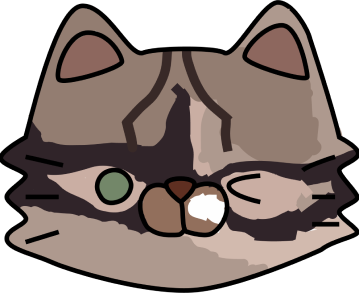

**"Дневник питомца"** — это мобильное приложение, разработанное для удобного управления информацией о ваших питомцах и их событиях.

Основные функции приложения:

1. Создание и редактирование профилей питомцев.
2. Ведение календаря событий питомцев.
3. Уведомления о событиях.
4. Аутентификация через почту и пароль.