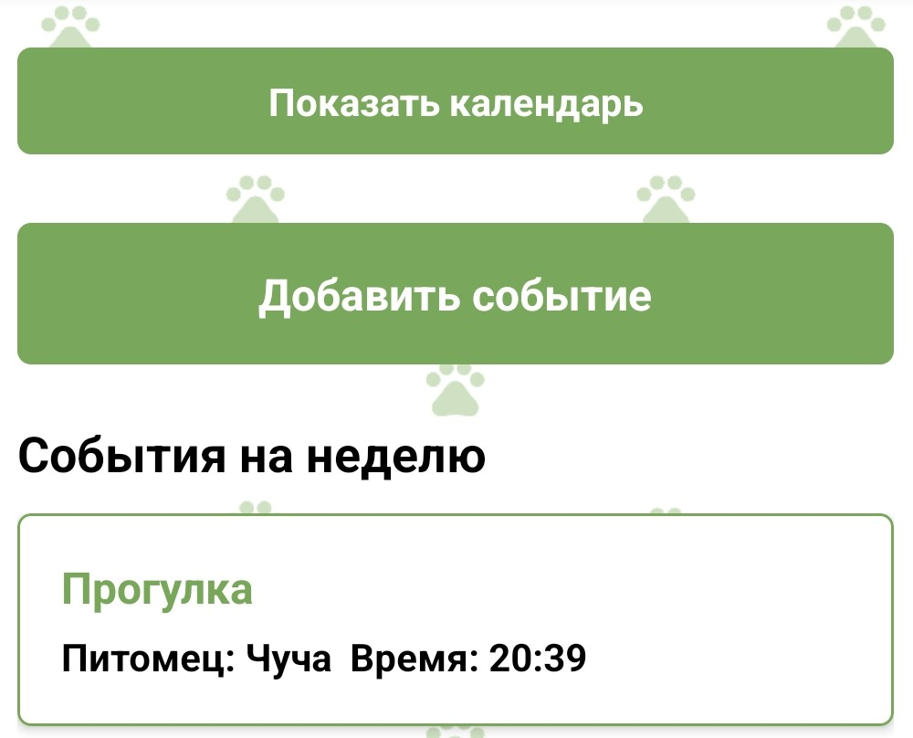
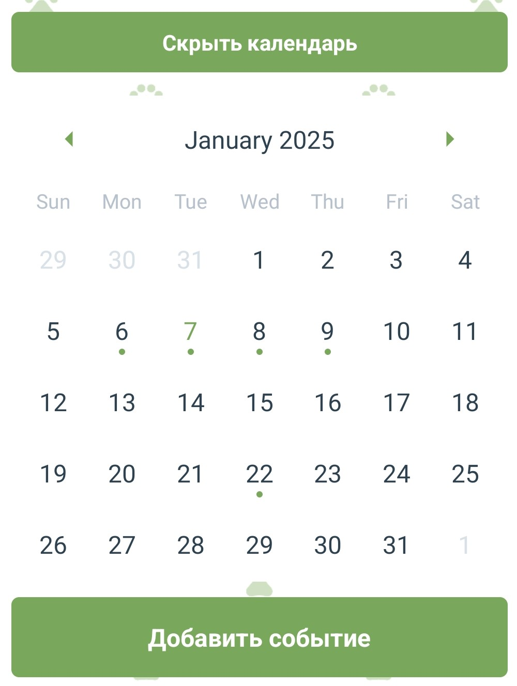

#### Возможности:

1. Создание событий для питомца.
2. Выбор типа события (кормежка, прогулка, поход к ветеринару и т. д.).
3. Добавление описания события.
4. Установка уведомлений.

#### Пример использования:

Представление события:

Список событий:

Календарь с событиями:

**Таблица типов событий:**

| Тип события       | Описание                  |
|-------------------|---------------------------|
| Кормежка          | Напоминание о кормлении   |
| Прогулка          | Планирование прогулок     |
| Поход ко врачу    | Посещение ветеринара      |
