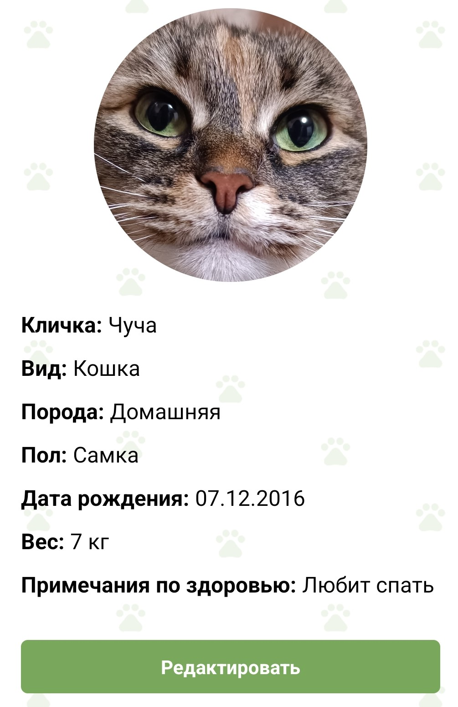

#### Возможности:

1. Создание нового профиля питомца с фото.
2. Редактирование информации о питомце (имя, возраст, порода т.д.).
3. В профиле так же можно указывать примечания по здоровью питомца.

**Пример изображения профиля питомца:**

